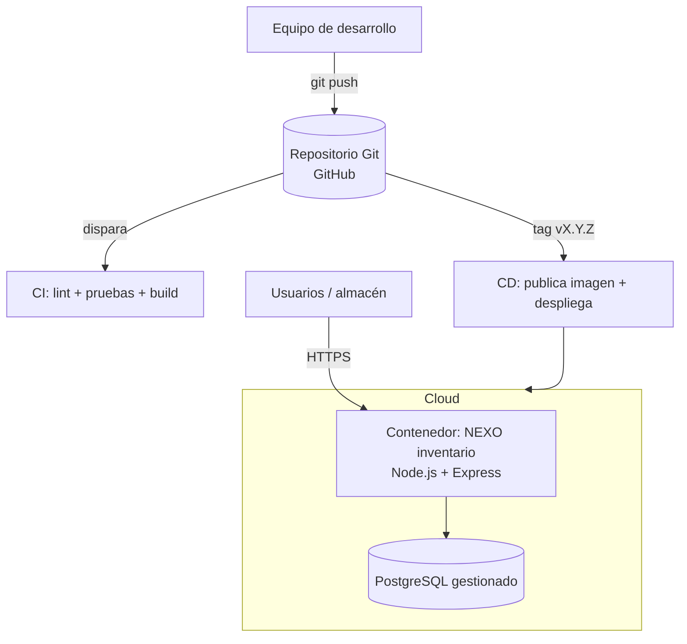

# Arquitectura de la solución

## Vista general

## Componentes

- **Aplicación:** API REST del módulo de inventario de NEXO (Node.js + Express).
- **Base de datos:** PostgreSQL (contenedor local con docker-compose; instancia
  gestionada en la nube).
- **Contenedores:** la aplicación se empaqueta con un `Dockerfile` multi-etapa
  y se orquesta localmente con `docker-compose` junto a la base de datos.
- **CI/CD:** GitHub Actions ejecuta la Integración Continua y la Entrega Continua.
- **IaC:** Terraform (o el Blueprint `render.yaml`) declara el ambiente Cloud de
  forma versionada y reproducible.

## Requerimientos técnicos del caso

| Aspecto | Definición |
|---|---|
| Lenguaje | JavaScript (Node.js 20) |
| Framework | Express |
| Base de datos | PostgreSQL 16 |
| Persistencia | Tabla `productos` (volumen de datos en local; instancia gestionada en la nube) |
| Puerto | 3000 (aplicación) · 5432 (base de datos) |
| Dependencias | express, pg, dotenv |
| Variables de entorno | NODE_ENV, PORT, DATABASE_URL / DB_* |
