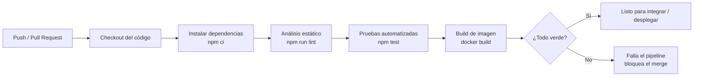
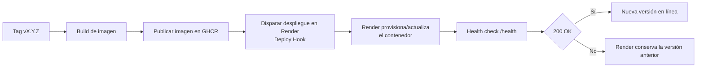

# Diagrama del pipeline CI/CD

## Integración Continua (CI) — `.github/workflows/ci.yml`

Disparador: cada `push` o `pull request` a `main` / `develop`.

**Condiciones de falla:** el pipeline se detiene y marca error si falla el
lint, si alguna prueba no pasa, o si la imagen no se construye. Con la rama
`main` protegida, un pipeline en rojo impide integrar el cambio.

## Entrega Continua (CD) — `.github/workflows/cd.yml`

Disparador: publicación de una etiqueta de versión `vX.Y.Z` (o ejecución manual).

Las credenciales (`GITHUB_TOKEN`, `RENDER_DEPLOY_HOOK_URL`) se gestionan como
**secretos de la plataforma** y nunca se escriben en el código.
